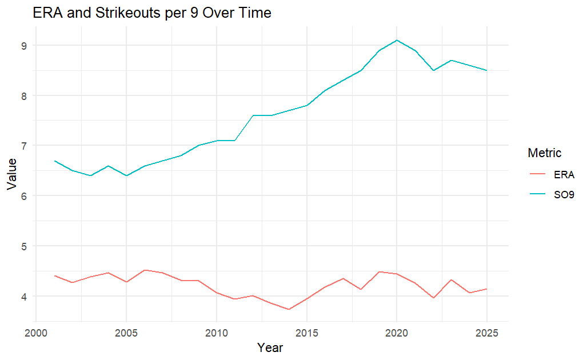

# How Pitching Has Changed: A Statistical Analysis of MLB Pitching Evolution

This repo is for Group 5's (Alfred, Nick, Bryan) course final project exploring how different factors affect pitching ERA within the MLB as well as how batting average has fluctuated throughout the different eras of the MLB.
## Overview

In our project, we looked into various statistics surrounding Major League Baseball pitching statistics spanning the past 25 years, from the 2001 season to this past 2025 season. One of our main focuses was on how various factors have affecte the Earned Run Average (ERA) over that time. We looked into strike outs per 9 innings, innings pitched,  number of pitchers, batting average on balls in play, and pitcher age. Our goal was to determine what affects each of these statistics may have on the overall league wide ERA trends during the time span, and how the game has changed in that span of time.

### Interesting Insight

One interesting insight that we have came across in our statistical analysis is that while the average strike outs per 9 innings had increased from around 6.5 to 9.0 strikeouts, the ERA had not maintained any continuous trend and has fluctuated around an average of 4.25 runs.

## Data Sources and Acknowledgements

https://www.baseball-reference.com/leagues/majors/pitch.shtml#all_teams_standard_pitching_totals
  - Data comes from the Lahmman Baseball Database, which is supplemented by the MLB.

https://baseballsavant.mlb.com/
  - Official MLB data visualization site for Statcast.

## Project Plan
1) Decide on Topic - MLB (COMPLETE)
2) Choose Statistic(s) - Pitching Trends (COMPLETE)
3) Find Database(s) (COMPLETE)
4) Create GitHub Repository (COMPLETE) 
5) Begin Statistical Analysis (COMPLETE)
6) Work-In-Progress Presentation (COMPLETE)
7) Select Most Insightful Data Trends Relative to ERA (COMPLETE)
8) Finish Statistical Analysis (COMPLETE)
9) Finish QMD Document (COMPLETE)
10) Make Final Updates to GitHub Repository (COMPLETE)
11) Submit Finished Project (COMPLETE)

## Repo Structure

The main branch is where you find the final published work that we have done for the project, with the PitchinData.csv being our data file and the Stat184_Final_Project.qmd serving as our QMD file. The README file that you are currently reading is the basic overview of our project and the rest of the files are files that were part of the base template (.gitignore, .lintr, MLA9.csl, Project_Guidelines.md, and apa7.csl). Besides the main branch, you have our individual dev branches for each of our group members to work on their own progress and run their own commits before merging with the main branch.

## Authors
Alfred Liljas: ahl5291@psu.edu
Nick Finn: naf5446@psu.edu
Bryan Dorneman: brd5397@psu.edu
